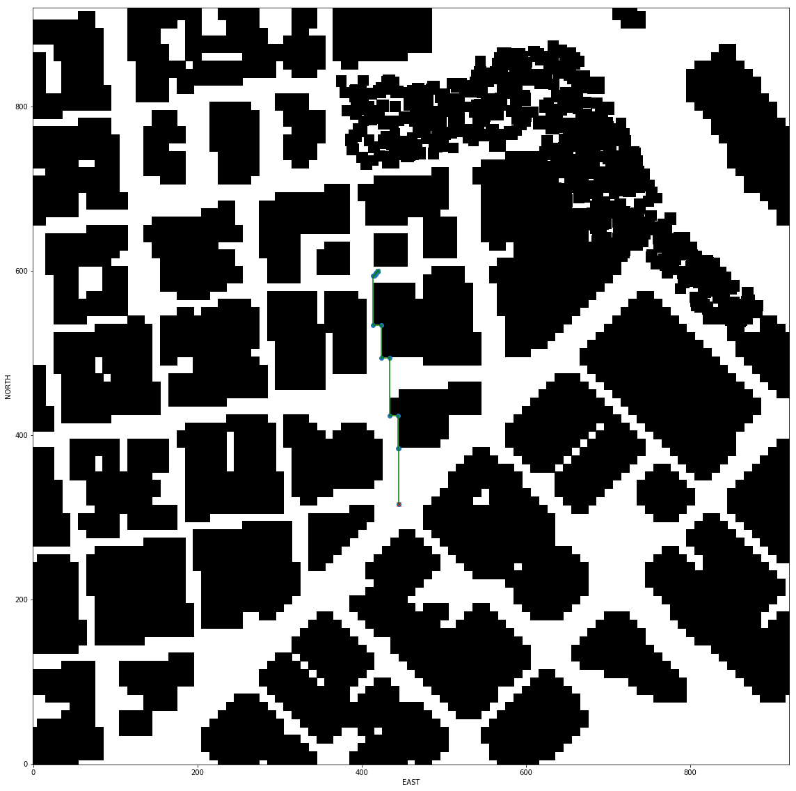

## 3D Motion Planning Project

### Project

The main information about the project can be accessed [here](https://github.com/udacity/FCND-Motion-Planning). 

###  Writeup

A writeup explaining the code can be accessed [here](https://github.com/ximenesfel/FCND_MotionPlanning_Project/blob/master/Writeup.md).

### Installation and running the code

1. Download Udacity simulator [here](https://github.com/udacity/FCND-Simulator-Releases/releases).
2. Install anaconda in your computer.
3. Create a new env using the `environment.yml` file:  `conda env create -f environment.yml`.
4. Enter inside env: `conda activate "your_env_name"`.
5. Clone this repository using `git clone https://github.com/ximenesfel/FCND_MotionPlanning_Project.git`.
6. Inside the repository, open `Motion Planning.ipynb` and select the values that you want in `Configuration values`section. If you only want to **reproduce the results** presented in this page, please download the `waipoints.hdf5` in Result section and save this file in project root folder. 
7. Run the jupyter notebbok until end to save a hdf5 file with all waypoints.
8. Open Udacity simulator and select `Motion Planning` option.
9. Inside the repository run: `python motion_planning.py`.

### Results

####  Grid search

  

- [Video](https://youtu.be/BqUT-O4SKQw)
- [waypoints.hdf5](https://drive.google.com/open?id=1rRqHQtQCCOBiPc06aT7DHnBgrypCMQ9P)

#### Graph search

  

- [Video](https://youtu.be/HgLd2bXOtvY)
- [waypoints.hdf5](https://drive.google.com/file/d/1EgKbh1X7lYL85A-uBCIkoP_i_8vu9c4r/view?usp=sharing)

