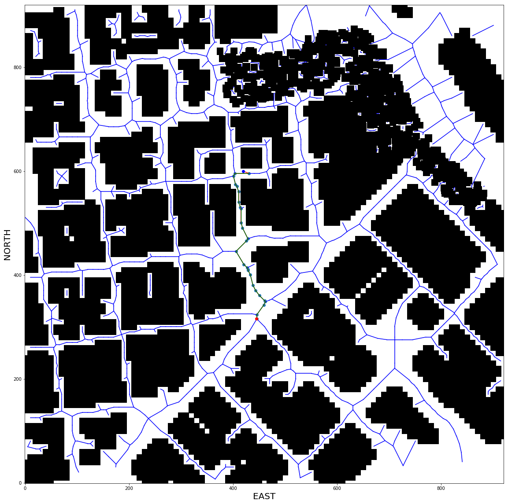

## Writeup - Project: 3D Motion Planning


## Table of contents

1. [Path planning algorithm](#path)

   1.1 [Introduction](#introduction)

   1.2 [Configuration values](#configuration)

   1.3 [Grid search](#grid)

   1.4 [Graph search](#graph)

   1.5 [Saving waypoints](#saving)

2. [Planning path function - motion_planning.py](#planning)

3. [Heading commands](#heading)

4. [Results](#results)

    4.1 [Grid search](#grid_result)

    4.2 [Graph search](#graph_result) 

5. [Future work](#future)


<a name="path" />

## 1. Path planning algorithm

<a name="introduction" />

### 1.1 Introduction

In this project the path planning algorithm was developed outside the project folder because performing this task while running simulator was taking much time. All path planning algorithm was developed in [**Motion Planning.ipynb**](https://github.com/ximenesfel/FCND_MotionPlanning_Project/blob/master/Motion%20Planning.ipynb).

<a name="configuration" />

### 1.2 Configuration values

In configuration values, the user can determine many parameters:

* Hdf5 file output path
* The drone altitude
* The minimum distance from drone stay away from obstacles
* A method to obtain the path
* The final location of the drone

```python
# Creating Config() object
config = Config()

# The output path where the programm will save hdf5 file 
outputPath = "./waypoints.hdf5"

# Static drone altitude (meters)
drone_altitude = 5.0

# Minimum distance stay away from obstacle (meters)
safe_distance = 5.0

# Select the method [grid_search, graph_search]
method = "graph_search"

# Include here the values of NED of final position
north = 600
east = 100
down = drone_altitude

ned_position = (north - config.north_home, east - config.east_home, down - config.down_home)
global_home = (config.long, config.lat, config.up)

global_position = local_to_global(ned_position, global_home)
#print(global_position)

start_ne = config.start_ne
goal_ne = (north, east)

# Read all the values from obstacles in csv file;
data = np.loadtxt('colliders.csv', delimiter=',', dtype='Float64', skiprows=2)
```

In this code, the home position was configured in [**config.py**](https://github.com/ximenesfel/FCND_MotionPlanning_Project/blob/master/config.py). So if the user want to change this value, this can be done in this file. Using this information the global_home variable is set. 

All utility functions are configured in [**planning_utils.py**](https://github.com/ximenesfel/FCND_MotionPlanning_Project/blob/master/planning_utils.py)  The global position is calculated using the local_to_global function. 

The last step is read all the values of obstacles in map from `colliders.csv`.

<a name="grid" />

### 1.3 Grid search

The first step to perform a grid search is create a grid using the obstacle data.

```python
grid, north_offset, east_offset = create_grid(data, drone_altitude, safe_distance)
```

```python
def create_grid(data, drone_altitude, safety_distance):
    """
    Returns a grid representation of a 2D configuration space
    based on given obstacle data, drone altitude and safety distance
    arguments.
    """

    # minimum and maximum north coordinates
    north_min = np.floor(np.min(data[:, 0] - data[:, 3]))
    north_max = np.ceil(np.max(data[:, 0] + data[:, 3]))

    # minimum and maximum east coordinates
    east_min = np.floor(np.min(data[:, 1] - data[:, 4]))
    east_max = np.ceil(np.max(data[:, 1] + data[:, 4]))

    # given the minimum and maximum coordinates we can
    # calculate the size of the grid.
    north_size = int(np.ceil(north_max - north_min))
    east_size = int(np.ceil(east_max - east_min))

    # Initialize an empty grid
    grid = np.zeros((north_size, east_size))

    # Populate the grid with obstacles
    for i in range(data.shape[0]):
        north, east, alt, d_north, d_east, d_alt = data[i, :]
        if alt + d_alt + safety_distance > drone_altitude:
            obstacle = [
                int(np.clip(north - d_north - safety_distance - north_min, 0, north_size-1)),
                int(np.clip(north + d_north + safety_distance - north_min, 0, north_size-1)),
                int(np.clip(east - d_east - safety_distance - east_min, 0, east_size-1)),
                int(np.clip(east + d_east + safety_distance - east_min, 0, east_size-1)),
            ]
            grid[obstacle[0]:obstacle[1]+1, obstacle[2]:obstacle[3]+1] = 1

    return grid, int(north_min), int(east_min)
```

Now, we have to use an algorithm to compute the path from start to end point selected. In that case A* was used.

```python
path, cost = a_star(grid, heuristic, start_ne, goal_ne)
```

```python
def a_star(grid, h, start, goal):

    path = []
    path_cost = 0
    queue = PriorityQueue()
    queue.put((0, start))
    visited = set(start)

    branch = {}
    found = False

    while not queue.empty():
        item = queue.get()
        current_node = item[1]
        if current_node == start:
            current_cost = 0.0
        else:
            current_cost = branch[current_node][0]

        if current_node == goal:
            print('Found a path.')
            found = True
            break
        else:
            for action in valid_actions(grid, current_node):
                # get the tuple representation
                da = action.delta
                next_node = (current_node[0] + da[0], current_node[1] + da[1])
                branch_cost = current_cost + action.cost
                queue_cost = branch_cost + h(next_node, goal)

                if next_node not in visited:
                    visited.add(next_node)
                    branch[next_node] = (branch_cost, current_node, action)
                    queue.put((queue_cost, next_node))

    if found:
        # retrace steps
        n = goal
        path_cost = branch[n][0]
        path.append(goal)
        while branch[n][1] != start:
            path.append(branch[n][1])
            n = branch[n][1]
        path.append(branch[n][1])
    else:
        print('**********************')
        print('Failed to find a path!')
        print('**********************')
    return path[::-1], path_cost
```

In order to try to reduce the number of path points, a prune algorithm was used.

```python
pruned_path = prune_path(path)
```

```python
def point(p):
    return np.array([p[0], p[1], 1.]).reshape(1, -1)

def collinearity_check(p1, p2, p3, epsilon=1e-2):
    m = np.concatenate((p1, p2, p3), 0)
    det = np.linalg.det(m)
    return abs(det) < epsilon

def prune_path(path):

    pruned_path = [p for p in path]

    i = 0
    while i < len(pruned_path) - 2:
        p1 = point(pruned_path[i])
        p2 = point(pruned_path[i + 1])
        p3 = point(pruned_path[i + 2])

        if collinearity_check(p1, p2, p3):
            pruned_path.remove(pruned_path[i + 1])
        else:
            i += 1
    return pruned_path
```

The simulator doesn't understand path point, so a conversion to waypoint is necessary.

```pytho
waypoints = [[int(p[0]) + north_offset, int(p[1]) + east_offset, int(drone_altitude), 0] for p in pruned_path]
```

And a plot the path is generated.

```python
plt.imshow(grid, cmap='Greys', origin='lower')

    plt.plot(start_ne[1], start_ne[0], 'rx')
    plt.plot(goal_ne[1], goal_ne[0], 'gx')

    pp = np.array(pruned_path)
    plt.plot(pp[:, 1], pp[:, 0], 'g')
    plt.scatter(pp[:, 1], pp[:, 0])

    plt.xlabel('EAST')
    plt.ylabel('NORTH')

    plt.show()
```


<a name="graph" />

### 1.4 Graph search

The first step to perform a graph search is create a grid with edges using the obstacle data.

```python
grid, edges = create_grid_and_edges(data, drone_altitude, safe_distance)
```

```python
def create_grid_and_edges(data, drone_altitude, safety_distance):
    """
    Returns a grid representation of a 2D configuration space
    along with Voronoi graph edges given obstacle data and the
    drone's altitude.
    """
    # minimum and maximum north coordinates
    north_min = np.floor(np.min(data[:, 0] - data[:, 3]))
    north_max = np.ceil(np.max(data[:, 0] + data[:, 3]))

    # minimum and maximum east coordinates
    east_min = np.floor(np.min(data[:, 1] - data[:, 4]))
    east_max = np.ceil(np.max(data[:, 1] + data[:, 4]))

    # given the minimum and maximum coordinates we can
    # calculate the size of the grid.
    north_size = int(np.ceil(north_max - north_min))
    east_size = int(np.ceil(east_max - east_min))

    # Initialize an empty grid
    grid = np.zeros((north_size, east_size))

    # Initialize an empty list for Voronoi points
    points = []

    # Populate the grid with obstacles
    for i in range(data.shape[0]):
        north, east, alt, d_north, d_east, d_alt = data[i, :]
        if alt + d_alt + safety_distance > drone_altitude:
            obstacle = [
                int(np.clip(north - d_north - safety_distance - north_min, 0, north_size - 1)),
                int(np.clip(north + d_north + safety_distance - north_min, 0, north_size - 1)),
                int(np.clip(east - d_east - safety_distance - east_min, 0, east_size - 1)),
                int(np.clip(east + d_east + safety_distance - east_min, 0, east_size - 1)),
            ]
            grid[obstacle[0]:obstacle[1] + 1, obstacle[2]:obstacle[3] + 1] = 1

            # add center of obstacles to points list
            points.append([north - north_min, east - east_min])


    # location of obstacle centres
    graph = Voronoi(points)

    edges = []
    for v in graph.ridge_vertices:
        p1 = graph.vertices[v[0]]
        p2 = graph.vertices[v[1]]

        cells = list(bresenham(int(p1[0]), int(p1[1]), int(p2[0]), int(p2[1])))
        hit = False

        for c in cells:

            # First check if we're off the map
            if np.amin(c) < 0 or c[0] >= grid.shape[0] or c[1] >= grid.shape[1]:
                hit = True
                break

            # Next check if we're in collision
            if grid[c[0], c[1]] == 1:
                hit = True
                break

        # If the edge does not hit on obstacle
        # add it to the list
        if not hit:
            # array to tuple for future graph creation step)
            p1 = (p1[0], p1[1])
            p2 = (p2[0], p2[1])
            edges.append((p1, p2))

    return grid, edges
```

After that a graph represention need to be created.

```python
G = nx.Graph()
    for e in edges:
        p1 = e[0]
        p2 = e[1]
        dist = LA.norm(np.array(p2) - np.array(p1))
        G.add_edge(p1, p2, weight=dist)
```

As the clear path was divided in edge, a close point search we be done between available edges and point selected.

```python
 start_ne_g = closest_point(G, start_ne)
 goal_ne_g = closest_point(G, goal_ne)
```

Now, we have to use an algorithm to compute the path from start to end point selected. In that case A* was used.

```python
path, cost = a_star_graph(G, heuristic, start_ne_g, goal_ne_g)
```

```python
def a_star_graph(graph, h, start, goal):
    """Modified A* to work with NetworkX graphs."""
	
    
    path = []
    path_cost = 0
    queue = PriorityQueue()
    queue.put((0, start))
    visited = set(start)

    branch = {}
    found = False

    # While has data in queue perform the search
    while not queue.empty():
        item = queue.get()
        current_node = item[1]
        if current_node == start:
            current_cost = 0.0
        else:
            current_cost = branch[current_node][0]

        if current_node == goal:
            print('Found a path.')
            found = True
            break
        else:
            for next_node in graph[current_node]:
                cost = graph.edges[current_node, next_node]['weight']
                branch_cost = current_cost + cost
                queue_cost = branch_cost + h(next_node, goal)

                if next_node not in visited:
                    visited.add(next_node)
                    branch[next_node] = (branch_cost, current_node)
                    queue.put((queue_cost, next_node))
	
    if found:
        # retrace steps
        n = goal
        path_cost = branch[n][0]
        path.append(goal)
        while branch[n][1] != start:
            path.append(branch[n][1])
            n = branch[n][1]
        path.append(branch[n][1])
    else:
        print('**********************')
        print('Failed to find a path!')
        print('**********************')
    return path[::-1], path_cost
```

In order to try to reduce the number of path points, a prune algorithm was used similar to grid search.

The simulator doesn't understand path point, so a conversion to waypoint is necessary. This function is equal to used in grid search

And a plot the path is generated.

```python
plt.imshow(grid, origin='lower', cmap='Greys') 

    for e in edges:
        p1 = e[0]
        p2 = e[1]
        plt.plot([p1[1], p2[1]], [p1[0], p2[0]], 'b-')
    
    plt.plot([start_ne[1], start_ne_g[1]], [start_ne[0], start_ne_g[0]], 'r-')
    for i in range(len(path)-1):
        p1 = path[i]
        p2 = path[i+1]
        plt.plot([p1[1], p2[1]], [p1[0], p2[0]], 'r-')
    plt.plot([goal_ne[1], goal_ne_g[1]], [goal_ne[0], goal_ne_g[0]], 'r-')
    
    pp = np.array(pruned_path)
    plt.plot(pp[:, 1], pp[:, 0], 'g')
    plt.scatter(pp[:, 1], pp[:, 0])

    plt.plot(start_ne[1], start_ne[0], 'ro')
    plt.plot(goal_ne[1], goal_ne[0], 'bo')

    plt.xlabel('EAST', fontsize=20)
    plt.ylabel('NORTH', fontsize=20)
    plt.show()
```


<a name="saving" />

### 1.5 Saving waypoints

After performing the path computation and converting to waypoint, a hdf5 file is created with all waypoints.

```python
data_file = h5py.File('waypoints.hdf5', 'w')
data_file.create_dataset('data', data=waypoints)
data_file.close()
print("Waypoints.hdf5 saved successufully")
```


<a name="planning" />

## 2. Planning path function - **motion_planning.py**

In plan_path function in motion_planning.py we read the hdf5 file and send the waypoints to simulator.

```python
def plan_path(self):

        self.flight_state = States.PLANNING

        # Read hdf5 file
        f = h5py.File('waypoints.hdf5', 'r')
        a_group_key = list(f.keys())[0]

        # Get the waypoint from hdf5 file
        waypoints = list(f[a_group_key][()])

        # Convert to a data that simulator understand
        waypoints = [ [int(p[0]), int(p[1]), int(p[2]), int(p[3])] for p in waypoints]

        # Set self.waypoints
        self.waypoints = waypoints

        # Send waypoint to simulator
        self.send_waypoints()
```

<a name="heading" />

## 3. Heading commands

As an extra challenge, the addition of heading commands to waypoint was proposed. To do this task, I followed the pseudo code presented in projet Readme.md.

```python
def waypoint_transition(self):

        self.previous_position = self.target_position

        if len(self.waypoints):

            print("[INFO] Waypoint transition ...")
            self.target_position = self.waypoints.pop(0)
            print('[INFO] Target position: ', self.target_position)

            if len(self.waypoints):

                # Obaining the next two points from waypoint

                if self.index == 0:
                    self.cmd_position(self.target_position[0], self.target_position[1], self.target_position[2], 0)
                    self.index += 1
                    self.flight_state = States.WAYPOINT

                else:

                    waypointActual = self.previous_position
                    waypointNext = self.target_position


                    self.heading = np.arctan2((waypointNext[1] - waypointActual[1]),
                                              (waypointNext[0] - waypointActual[0]))


                    self.cmd_position(self.target_position[0], self.target_position[1], self.target_position[2],
                                      self.heading)

                    self.index += 1

                    self.flight_state = States.WAYPOINT

            else:
                waypointActual = self.previous_position
                waypointNext = self.target_position
                self.heading = np.arctan2((waypointNext[1] - waypointActual[1]), (waypointNext[0] - waypointActual[0]))

                self.cmd_position(self.target_position[0], self.target_position[1], self.target_position[2],
                                  self.heading)

```

<a name="results" />

## 4. Results

In order to reproduce the results, look at Readme file [here](https://github.com/ximenesfel/FCND_MotionPlanning_Project).

<a name="grid_result" />

### 4.1 Grid search

<div style="text-align: center">
  
</div>


* [Video](https://youtu.be/BqUT-O4SKQw)
* [waypoints.hdf5](https://drive.google.com/open?id=1rRqHQtQCCOBiPc06aT7DHnBgrypCMQ9P)


<a name="graph_result" />

### 4.2 Graph search

<div style="text-align: center">
  
</div>

- [Video](https://youtu.be/HgLd2bXOtvY)
- [waypoints.hdf5](https://drive.google.com/file/d/1EgKbh1X7lYL85A-uBCIkoP_i_8vu9c4r/view?usp=sharing)


<a name="future" />

### 5. Future work

* Implement 3D navigation
* Implement others algorithms (RRT, probabilistic roadmap, receding horizon planning)
* Implement visdom to visualize data in real time